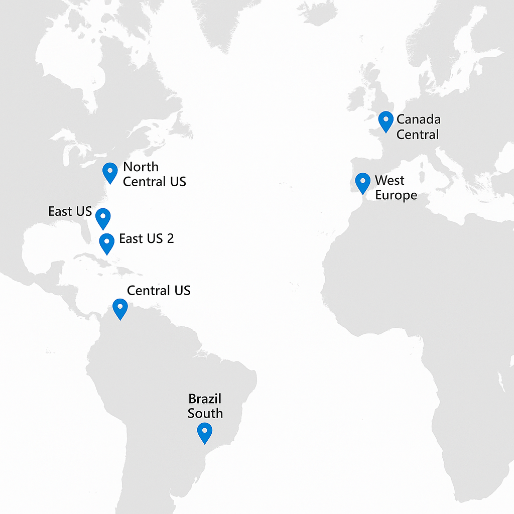

# 📘 Comparativo de Regiões Azure

Este documento apresenta uma visão comparativa de diversas regiões da Microsoft Azure, considerando custo, latência, disponibilidade de serviços e suporte a recursos avançados como GPU e Spot VMs. Isso ajuda a escolher a melhor região para implantar sua infraestrutura, considerando fatores de desempenho e orçamento.

---

### 🌍 Tabela Comparativa de Regiões

| Região Azure        | Nome Técnico       | 💵 Preço | 🌐 Latência 🇧🇷 | ⚙️ Serviços | 🛡️ Zonas | 🎮 GPU | ⚡ Spot VM | 📝 Observações |
|---------------------|--------------------|----------|-----------------|--------------|-----------|--------|------------|----------------|
| East US             | `eastus`           | 💲       | Média (~120ms)  | Alta         | ✅ 3       | ✅     | ✅          | Região densa e com suporte amplo |
| East US 2           | `eastus2`          | 💲       | Média (~130ms)  | Alta         | ✅ 3       | ✅     | ✅          | Excelente para HA no Leste |
| North Central US    | `northcentralus`   | 💲       | Alta (~180ms)   | Média        | ❌         | ❌     | ✅          | Custo baixo, mas menos recursos modernos |
| Central US          | `centralus`        | 💲💲     | Alta (~190ms)   | Alta         | ✅ 3       | ✅     | ✅          | Uma das regiões mais resilientes |
| West US 2           | `westus2`          | 💲💲     | Alta (~210ms)   | Alta         | ✅ 3       | ✅     | ✅          | Substitui a obsoleta `westus` |
| Brazil South        | `brazilsouth`      | 💲💲💲   | Baixa (~20ms)   | Limitado     | ❌         | ❌     | ❌          | Mais próxima, mas com suporte restrito |
| South Central US    | `southcentralus`   | 💲       | Alta (~160ms)   | Alta         | ✅ 3       | ✅     | ✅          | Excelente para balancear custo e latência |
| West Europe         | `westeurope`       | 💲💲     | Média (~130ms)  | Alta         | ✅ 3       | ✅     | ✅          | Forte integração com zonas da Europa |
| North Europe        | `northeurope`      | 💲💲     | Média (~140ms)  | Alta         | ✅ 3       | ✅     | ✅          | Fallback natural de West Europe |
| Canada Central      | `canadacentral`    | 💲💲     | Alta (~160ms)   | Média        | ✅ 3       | ✅     | ✅          | Alternativa viável com boa oferta de serviços |

---

### 🔍 Legendas

- **💵 Preço**:
  - 💲: Mais barato
  - 💲💲: Médio
  - 💲💲💲: Mais caro

- **🌐 Latência**: Aproximada a partir de medições típicas de usuários no Brasil
- **⚙️ Serviços**: Quantidade e variedade de serviços disponíveis na região
- **🛡️ Zonas de Disponibilidade**:
  - ✅: Possui 3 zonas de disponibilidade para alta disponibilidade (HA)
  - ❌: Não possui ou possui cobertura limitada
- **🎮 GPU**: Suporte a máquinas com GPU para workloads de IA e HPC
- **⚡ Spot VM**: Suporte a VMs Spot (baixo custo, interrupção possível)

---

> ⚠️ *Os dados apresentados são aproximados e podem variar conforme o tipo de serviço, a disponibilidade da região no momento e a conectividade local. Consulte sempre o [site oficial da Azure](https://azure.microsoft.com/pt-br/global-infrastructure/geographies/) para atualizações.*
